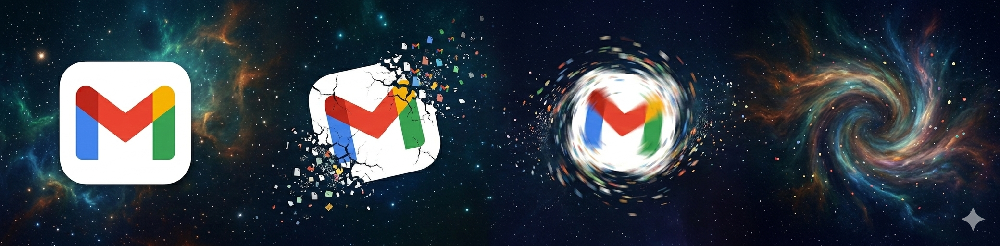

<p align="center">
  
</p>

# Keres

> Named after the Keres — spirits of violent death in Greek mythology, drawn to consume what is wasted and forgotten.

A CLI tool built in Go for cleaning up Gmail, Google Drive, and iCloud accounts. Tackles large email backlogs, duplicate files, and forgotten attachments.

## Features

### Gmail
- **Analyze** - Storage statistics, largest emails, top senders, unread counts
- **Clean Old Unread** - Archive or delete unread emails older than X days
- **Clean Promotions** - Bulk clean promotional emails
- **Clean Large Attachments** - Remove emails with attachments over a specified size
- **Unsubscribe** - Identify mailing lists and optionally unsubscribe

### Google Drive
- **Analyze** - Storage quota, largest files, file type breakdown, trash usage
- **Find Duplicates** - Detect duplicate files by name, size, or hash
- **Empty Trash** - Permanently delete trashed files
- **Large Files** - Find and review largest files
- **Old Files** - Find files not accessed in X days

### iCloud Drive (macOS only)
- **Analyze** - Storage usage, file type breakdown, largest and oldest files
- **Find Duplicates** - Detect duplicates by content hash
- **Large Files** - Find files larger than specified size
- **Old Files** - Find files not modified in X days

### Photos Library (macOS only)
- **Analyze** - Storage by year and media type, potential duplicates
- **Largest Items** - Find largest photos and videos
- **Semantic Search** - Search photos using natural language (requires ML service)

## Installation

### Prerequisites
1. **Go 1.21 or higher** - [Download Go](https://golang.org/dl/)
2. **Google Cloud Project with OAuth2 credentials** (see setup below)

### Build from Source

```bash
go mod download
go build -o keres
```

### Install Globally (Optional)

```bash
go install
```

## Google API Setup

### 1. Create a Google Cloud Project

1. Go to [Google Cloud Console](https://console.cloud.google.com/)
2. Create a new project or select an existing one

### 2. Enable Required APIs

- Gmail API: https://console.cloud.google.com/apis/library/gmail.googleapis.com
- Google Drive API: https://console.cloud.google.com/apis/library/drive.googleapis.com

### 3. Create OAuth2 Credentials

1. Go to [Credentials page](https://console.cloud.google.com/apis/credentials)
2. Click "Create Credentials" → "OAuth client ID"
3. Configure the OAuth consent screen if prompted:
   - User Type: External
   - App name: Keres
   - Add your email as a test user
4. Application type: **Desktop app**
5. Download the JSON file

### 4. Save Credentials

```bash
mkdir -p ~/.keres
mv ~/Downloads/client_secret_*.json ~/.keres/credentials.json
```

## Usage

### Authentication

```bash
./keres auth login
./keres auth status
./keres auth logout
```

Credentials are cached at `~/.keres/token.json`.

### Gmail

```bash
./keres gmail analyze --limit 1000

# Dry run (default)
./keres gmail clean-old --days 365 --action archive

# Apply
./keres gmail clean-old --days 365 --action delete --dry-run=false

# Skip senders you've ever replied to
./keres gmail clean-old --days 365 --action delete --skip-replied --dry-run=false

./keres gmail clean-promotions --older-than 30 --action archive --dry-run=false
./keres gmail clean-large --min-size 25MB --action delete --dry-run=false
./keres gmail unsubscribe
```

### Google Drive

```bash
./keres drive analyze
./keres drive find-duplicates --method name-size
./keres drive find-duplicates --method hash
./keres drive empty-trash --dry-run=false
./keres drive large-files --limit 50 --min-size 100MB
./keres drive old-files --days 730
```

### iCloud Drive (macOS only)

```bash
./keres icloud analyze
./keres icloud find-duplicates
./keres icloud large-files --min-size 100MB --limit 50
./keres icloud old-files --days 730 --limit 100
```

### Photos Library (macOS only)

```bash
./keres photos analyze
./keres photos largest --limit 50
```

Semantic search (requires ML service):
```bash
cd ml_service && python3 -m venv venv && source venv/bin/activate
pip install -r requirements.txt && python app.py
```

```bash
./keres photos index
./keres photos search "beach sunset"
./keres photos search "photos of my dog"
```

## Safety

- Most destructive commands default to `--dry-run=true`
- Default action is archive, not delete
- Must explicitly pass `--dry-run=false` to apply changes

## Security & Privacy

- OAuth tokens stored locally in `~/.keres/`
- All processing happens locally, no data sent to third parties
- Analysis commands only request read permissions

## Project Structure

```
keres/
├── main.go
├── cmd/
│   ├── root.go
│   ├── auth.go
│   ├── gmail.go
│   ├── drive.go
│   ├── icloud.go
│   └── photos.go
├── internal/
│   ├── auth/google.go
│   ├── gmail/cleanup.go
│   ├── drive/cleanup.go
│   ├── icloud/drive.go
│   └── photos/library.go
├── ml_service/
│   ├── app.py
│   ├── requirements.txt
│   └── README.md
├── docs/ICLOUD_DESIGN.md
├── setup.sh
├── Makefile
└── go.mod
```

## Troubleshooting

**"Unable to read client secret file"** — Save credentials to `~/.keres/credentials.json`.

**"Authentication failed"** — Run `./keres auth logout` then `./keres auth login`.

**Rate limiting** — Gmail API has per-user quotas. Wait a few minutes between large operations.

## License

MIT
